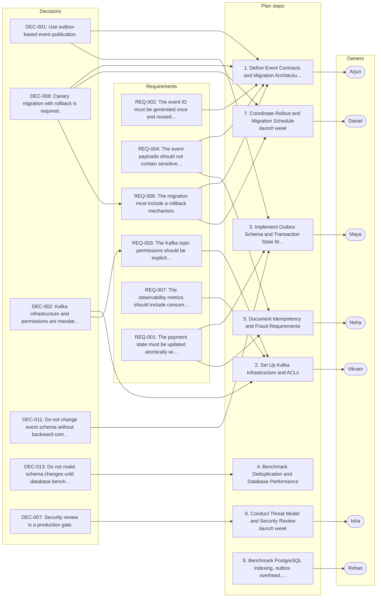

# Checkout Platform — Distributed Transaction & Event Architecture Review

_Generated by Planar on 2026-10-07 10:52 UTC._

## Decisions (13)

- **DEC-001** Use outbox-based event publication.
  > (L382) “1. Outbox-based event publication.”

- **DEC-002** Kafka infrastructure and permissions are mandatory.
  > (L383) “2. Kafka infrastructure and permissions.”

- **DEC-003** Order-level partitioning is the default.
  > (Arjun, L103) “Default Kafka partitioning should use order_id. If a downstream consumer needs stronger ordering semantics, it needs to solve that within its own domain rather than changing the platform-wide key.”

- **DEC-004** At-least-once delivery with idempotent consumers is sufficient.
  > (Arjun, L248) “At-least-once delivery with idempotent consumers is sufficient.”

- **DEC-005** Retry and dead-letter handling are required.
  > (L386) “5. Retry and dead-letter handling.”

- **DEC-006** OpenTelemetry propagation is required.
  > (L387) “6. OpenTelemetry propagation.”

- **DEC-007** Security review is a production gate.
  > (L213–219) “Daniel: Security review before production? … Isha: Yes, especially ACLs, credential lifecycle, event payloads, and threat modeling. … Isha: The security review is a production gate. The exact threat-model scope still needs to be finalized.”

- **DEC-008** Canary migration with rollback is required.
  > (L389) “8. Canary migration with rollback.”

- **DEC-009** Do not build separate service for payment authorization.
  > (L46–50) “Neha: There's another issue. Payment state currently changes through synchronous API calls. Some people suggested making payment authorization asynchronous too. … Arjun: Yes. We shouldn't introduce asynchronous payment authorization just because we're introducing asynchronous events elsewhere.”

- **DEC-010** Do not use customer-level partitioning.
  > (Vikram, L97) “Customer-level partitioning also creates worse hot-key behavior for enterprise customers.”

- **DEC-011** Do not change event schema without backward compatibility.
  > (Arjun, L290–294) “Backward compatibility at minimum. … Breaking schema changes should require a new event version.”

- **DEC-012** Do not assume Kafka storage encryption is enabled.
  > (Maya, L209) “Our managed Kafka provider says storage encryption is enabled.”

- **DEC-013** Do not make schema changes until database benchmark is reviewed.
  > (Maya, L411) “One final point: no production schema change until the database benchmark is reviewed.”

## Requirements (9)

- **REQ-001** The payment state must be updated atomically with the idempotency key.
  > (Arjun, L70) “"Should" again depends on the exact transaction boundary. If the idempotency record and payment state aren't committed atomically, there can still be a race.”

- **REQ-002** The event ID must be generated once and reused by all publishers.
  > (Maya, L240) “That means the event ID becomes part of the outbox record.”

- **REQ-003** The Kafka topic permissions should be explicit and topic-level.
  - From: DEC-002
  > (Arjun, L116) “Agreed. Producers and consumers should have explicit topic-level permissions.”

- **REQ-004** The event payloads should not contain sensitive payment information.
  > (Isha, L201) “We should explicitly prohibit sensitive payment information in event payloads and application logs.”

- **REQ-005** The Kafka retention period must be determined by legal and compliance requirements.
  > (L353–359) “Rohan: There's also Kafka retention. How long do we keep transaction events? … Vikram: Seven days would probably be enough operationally. … Arjun: We shouldn't choose retention until legal and compliance confirm the requirement.”

- **REQ-006** The migration must include a rollback mechanism.
  - From: DEC-008
  > (Arjun, L340) “The exact percentage isn't important yet. We need a rollback mechanism before exposing production traffic.”

- **REQ-007** The observability metrics should include consumer lag, retry counts, and processing latency.
  > (Vikram, L319) “And metrics should include consumer lag, retry counts, dead-letter volume, processing latency, and outbox publishing latency.”

- **REQ-008** The Kafka partitioning should use order_id as the default key.
  - From: DEC-003, DEC-010
  > (Arjun, L103) “Default Kafka partitioning should use order_id. If a downstream consumer needs stronger ordering semantics, it needs to solve that within its own domain rather than changing the platform-wide key.”

- **REQ-009** The checkout API should not wait for Kafka consumer processing.
  > (Arjun, L188) “Yes. The checkout API should not wait for Kafka consumer processing.”

## Tasks (7)

- [ ] **TSK-001** Own outbox schema and transaction-state changes _(medium; owner: Maya)_
  Maya will own the outbox schema and transaction-state changes
  > (Maya, L397) “I'll own the outbox schema and transaction-state changes.”

- [ ] **TSK-002** Own Kafka infrastructure, ACLs, observability, and migration tooling _(medium; owner: Vikram)_
  Vikram will own Kafka infrastructure, ACLs, observability, and migration tooling
  > (Vikram, L399) “I'll own Kafka infrastructure, ACLs, observability, and migration tooling.”

- [ ] **TSK-003** Benchmark PostgreSQL indexing, outbox overhead, and the Redis-versus-PostgreSQL deduplication approach _(medium; owner: Rohan)_
  Rohan will benchmark PostgreSQL indexing, outbox overhead, and the Redis-versus-PostgreSQL deduplication approach
  > (Rohan, L401) “I'll benchmark PostgreSQL indexing, outbox overhead, and the Redis-versus-PostgreSQL deduplication approach.”

- [ ] **TSK-004** Document payment idempotency and fraud ordering requirements _(medium; owner: Neha)_
  Neha will document payment idempotency and fraud ordering requirements
  > (Neha, L403) “I'll document payment idempotency and fraud ordering requirements.”

- [ ] **TSK-005** Own the threat model and security review _(medium; owner: Isha)_
  Isha will own the threat model and security review
  > (Isha, L405) “I'll own the threat model and security review.”

- [ ] **TSK-006** Define the event contracts and migration architecture _(medium; owner: Arjun)_
  Arjun will define the event contracts and migration architecture
  > (Arjun, L407) “I'll define the event contracts and migration architecture.”

- [ ] **TSK-007** Coordinate the rollout schedule and campaign deadline _(high; owner: Daniel; due: November promotion)_
  Daniel will coordinate the rollout schedule and campaign deadline
  - Done when (suggested): Rollout completed before November promotion
  > (Daniel, L409) “I'll coordinate the rollout schedule and campaign deadline.”

## Risks (8)

- **RSK-001** [medium] Outbox insert could increase database load.
  > (Rohan, L31) “Right. Which means adding an outbox insert to every transaction isn't free.”

- **RSK-002** [medium] Retry window could keep checkout workflow alive after user timeout.
  > (L184–188) “Neha: Especially because a retry can keep the checkout workflow technically alive even when the user has already timed out. … Arjun: Yes. The checkout API should not wait for Kafka consumer processing.”

- **RSK-003** [medium] Redis deduplication loss could cause duplicate event processing.
  > (L261–265) “Vikram: What happens if Redis loses state? … Neha: Which is exactly why PostgreSQL should remain the durable idempotency source for payment-related processing.”

- **RSK-004** [medium] Payment authorization timeout could result in false payment failure.
  > (L52–54) “Neha: The payment provider itself is eventually consistent in some cases. So even with synchronous authorization, we still need to handle an authorization response arriving after a timeout. … Maya: Exactly. The API timeout doesn't necessarily mean payment failed.”

- **RSK-005** [medium] Kafka partitioning may create hot-key behavior for enterprise customers.
  > (L97–99) “Vikram: Customer-level partitioning also creates worse hot-key behavior for enterprise customers. … Rohan: And changing the partition key later isn't trivial.”

- **RSK-006** [medium] Short-lived credentials may delay migration due to identity integration.
  > (L122–124) “Isha: And credentials should be short-lived workload credentials rather than static secrets. … Vikram: That would be ideal, but I don't want to block migration if the identity integration isn't ready.”

- **RSK-007** [medium] Reconciliation query could become expensive with read replicas.
  > (L145–147) “Vikram: Also, if reconciliation runs every minute, that query could become expensive. … Rohan: We could use a read replica.”

- **RSK-008** [medium] Event payload encryption may not be properly configured.
  > (L205–207) “Vikram: What about encrypted payloads? … Isha: Encryption in transit is mandatory. At-rest encryption depends on the Kafka cluster configuration and should be verified rather than assumed.”

## Open questions (6)

- **OQ-001** Topic-specific alert thresholds remain to be defined.
  Left unresolved in the meeting.
  > (Daniel, L331) “So topic-specific alert thresholds remain to be defined.”

- **OQ-002** What is the maximum retry window for events?
  Retry duration affects transaction completion.
  > (Vikram, L182) “Not yet. We need to model the effect on transaction completion time.”

- **OQ-003** What is the retention period for Kafka transaction events?
  Compliance may require longer retention.
  > (Rohan, L353) “There's also Kafka retention. How long do we keep transaction events?”

- **OQ-004** Should Redis deduplication be used in production?
  Redis state loss could cause duplicates.
  > (Daniel, L279) “Is Redis deduplication staying?”

- **OQ-005** Should schema registry be part of the migration?
  Schema compatibility is required.
  > (Arjun, L302) “Yes, but whether we use Confluent Schema Registry or the cloud provider's native registry is still open.”

- **OQ-006** Is the security review a production gate?
  Security is a production requirement.
  > (Isha, L219) “The security review is a production gate. The exact threat-model scope still needs to be finalized.”

## Implementation plan: Checkout Platform — Distributed Transaction & Event Architecture Review

It ensures compliance with legal, compliance, and observability requirements.

1. **Define Event Contracts and Migration Architecture** _(DEC-001, DEC-008, REQ-002, REQ-004, REQ-006, TSK-006)_
   Establish event schemas, contracts, and migration strategies for Kafka topics.
2. **Set Up Kafka Infrastructure and ACLs** _(DEC-002, REQ-003, REQ-007, TSK-002)_
   Provision Kafka cluster with explicit topic-level permissions and observability setup.
3. **Implement Outbox Schema and Transaction State Management** _(DEC-001, DEC-011, REQ-001, TSK-001)_
   Design and implement the outbox pattern for transaction state tracking and idempotency.
4. **Benchmark Deduplication and Database Performance** _(DEC-013)_
   Evaluate Redis versus PostgreSQL for deduplication and benchmark database performance.
5. **Document Idempotency and Fraud Requirements** _(REQ-001, REQ-004, TSK-004)_
   Create documentation for payment idempotency and fraud ordering logic.
6. **Conduct Threat Model and Security Review** · launch week _(DEC-007, TSK-005)_
   Perform security assessment and threat modeling for the payment pipeline.
7. **Coordinate Rollout and Migration Schedule** · launch week _(DEC-008, REQ-006, TSK-007)_
   Plan and execute canary deployment with rollback capability for the payment pipeline.
8. **Benchmark PostgreSQL indexing, outbox overhead, and the Redis-versus-PostgreSQL deduplication approach** _(TSK-003)_
   Rohan will benchmark PostgreSQL indexing, outbox overhead, and the Redis-versus-PostgreSQL deduplication approach

### Done when (suggested)

- [ ] Kafka infrastructure and permissions are mandatory.
- [ ] OpenTelemetry propagation is required.
- [ ] The Kafka topic permissions should be explicit and topic-level.
- [ ] The observability metrics should include consumer lag, retry counts, and processing latency.
- [ ] Use outbox-based event publication.
- [ ] At-least-once delivery with idempotent consumers is sufficient.
- [ ] The payment state must be updated atomically with the idempotency key.
- [ ] The event ID must be generated once and reused by all publishers.
- [ ] Order-level partitioning is the default.
- [ ] The Kafka partitioning should use order_id as the default key.
- [ ] Security review is a production gate.
- [ ] The event payloads should not contain sensitive payment information.

## Plan map

Not tied to a single step; these apply to the plan as a whole:

- **DEC-003** Order-level partitioning is the default.
- **DEC-004** At-least-once delivery with idempotent consumers is sufficient.
- **DEC-005** Retry and dead-letter handling are required.
- **DEC-006** OpenTelemetry propagation is required.
- **DEC-009** Do not build separate service for payment authorization.
- **DEC-010** Do not use customer-level partitioning.
- **DEC-012** Do not assume Kafka storage encryption is enabled.

Requirements not linked to any plan step:

- **REQ-005** The Kafka retention period must be determined by legal and compliance requirements.
- **REQ-008** The Kafka partitioning should use order_id as the default key.
- **REQ-009** The checkout API should not wait for Kafka consumer processing.
