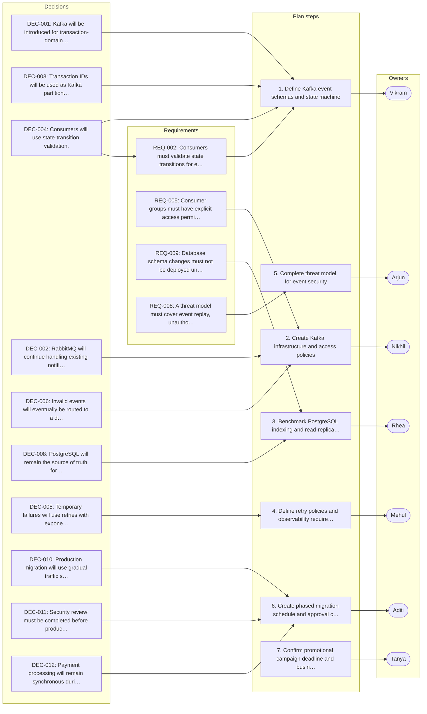

# Distributed Platform Migration & Reliability Review

_Generated by Planar on 2026-10-07 08:53 UTC._

## Decisions (12)

- **DEC-001** Kafka will be introduced for transaction-domain events.
  > (L267) “1. Kafka will be introduced for transaction-domain events.”

- **DEC-002** RabbitMQ will continue handling existing notification workloads during the initial migration.
  > (L268) “2. RabbitMQ will continue handling existing notification workloads during the initial migration.”

- **DEC-003** Transaction IDs will be used as Kafka partition keys.
  > (L269) “3. Transaction IDs will be used as Kafka partition keys.”

- **DEC-004** Consumers will use state-transition validation.
  > (L270) “4. Consumers will use state-transition validation.”

- **DEC-005** Temporary failures will use retries with exponential backoff and jitter.
  > (L271) “5. Temporary failures will use retries with exponential backoff and jitter.”

- **DEC-006** Invalid events will eventually be routed to a dead-letter topic.
  > (L272) “6. Invalid events will eventually be routed to a dead-letter topic.”

- **DEC-007** The system will use at-least-once delivery with idempotent consumers.
  > (L273) “7. The system will use at-least-once delivery with idempotent consumers.”

- **DEC-008** PostgreSQL will remain the source of truth for idempotency records.
  > (L274) “8. PostgreSQL will remain the source of truth for idempotency records.”

- **DEC-009** OpenTelemetry will be introduced for distributed tracing.
  > (L275) “9. OpenTelemetry will be introduced for distributed tracing.”

- **DEC-010** Production migration will use gradual traffic shifting.
  > (L276) “10. Production migration will use gradual traffic shifting.”

- **DEC-011** Security review must be completed before production Kafka traffic is enabled.
  > (L277) “11. Security review must be completed before production Kafka traffic is enabled.”

- **DEC-012** Payment processing will remain synchronous during the initial migration phases.
  > (L278) “12. Payment processing will remain synchronous during the initial migration phases.”

## Requirements (9)

- **REQ-001** Payment processing must remain synchronous until event-driven architecture is validated.
  - From: DEC-012
  > (L251) “Payment processing will remain on the existing synchronous workflow until the team has sufficient confidence in the event-driven architecture.”

- **REQ-002** Consumers must validate state transitions for events.
  - From: DEC-004
  > (L92) “Each consumer would validate whether an incoming event represents a valid state transition.”

- **REQ-003** Exactly-once processing is not required; at-least-once with idempotent consumers is acceptable.
  - From: DEC-007
  > (L118–122) “Arjun asked whether the new architecture required exactly-once processing guarantees. … Vikram said true exactly-once semantics across PostgreSQL, Kafka, and external services would significantly increase implementation complexity. … He recommended at-least-once delivery with idempotent consumers.”

- **REQ-004** Kafka topics containing transaction data must use encryption in transit.
  > (L221) “Kafka topics containing transaction information must use encryption in transit.”

- **REQ-005** Consumer groups must have explicit access permissions.
  > (L223) “Consumer groups must have explicit access permissions.”

- **REQ-006** Services should authenticate using short-lived workload credentials.
  > (L225) “Services should authenticate using short-lived workload credentials rather than long-lived API keys.”

- **REQ-007** Sensitive payment information must never be included in Kafka events or logs.
  > (L227) “Sensitive payment information must never be included in Kafka event payloads or application logs.”

- **REQ-008** A threat model must cover event replay, unauthorized publication, privilege escalation, and cross-tenant exposure.
  > (L229) “Arjun also requested a threat model covering event replay, unauthorized event publication, privilege escalation, and cross-tenant data exposure.”

- **REQ-009** Database schema changes must not be deployed until benchmark results are available.
  > (L160) “No production database schema changes will be deployed until the benchmark is completed.”

## Tasks (7)

- [ ] **TSK-001** Define Kafka event schemas and state machine _(medium; owner: Vikram)_
  Define the Kafka event schemas and transaction state machine
  - Done when (suggested): state machine validated
  > (Vikram, L284) “Define the Kafka event schemas and transaction state machine.”

- [ ] **TSK-002** Create Kafka infrastructure and access policies _(medium; owner: Nikhil)_
  Create the initial Kafka infrastructure and document topic-level access policies
  - Done when (suggested): Kafka infrastructure operational
  - Done when (suggested): topic-level access policies documented
  > (Nikhil, L286) “Create the initial Kafka infrastructure and document topic-level access policies.”

- [ ] **TSK-003** Benchmark PostgreSQL indexing and read-replica performance _(medium; owner: Rhea)_
  Benchmark PostgreSQL indexing strategies and read-replica performance
  - Done when (suggested): Benchmark results available
  - Done when (suggested): read-replica viability determined
  > (Rhea, L288) “Benchmark PostgreSQL indexing strategies and read-replica performance.”

- [ ] **TSK-004** Define retry policies and observability requirements _(medium; owner: Mehul)_
  Define retry policies, observability requirements, and workload-specific alert thresholds
  - Done when (suggested): Retry policy defined
  - Done when (suggested): observability requirements documented
  - Done when (suggested): alert thresholds per workload
  > (Mehul, L290) “Define retry policies, observability requirements, and workload-specific alert thresholds.”

- [ ] **TSK-005** Complete threat model for event security _(medium; owner: Arjun)_
  Complete the threat model covering replay attacks, unauthorized event publication, and cross-tenant exposure
  - Done when (suggested): Threat model complete
  - Done when (suggested): replay and exposure risks addressed
  - Implements: REQ-008
  > (Arjun, L292) “Complete the threat model covering replay attacks, unauthorized event publication, and cross-tenant exposure.”

- [ ] **TSK-006** Create phased migration schedule and approval criteria _(medium; owner: Aditi)_
  Create the phased migration schedule and establish approval criteria for increasing production traffic
  - Done when (suggested): Migration schedule defined
  - Done when (suggested): approval criteria for traffic increase established
  > (Aditi, L294) “Create the phased migration schedule and establish approval criteria for increasing production traffic.”

- [ ] **TSK-007** Confirm promotional campaign deadline and business constraints _(medium; owner: Tanya)_
  Confirm the promotional campaign deadline and communicate business constraints to engineering
  - Done when (suggested): Campaign deadline confirmed
  - Done when (suggested): business constraints communicated
  > (Tanya, L296) “Confirm the promotional campaign deadline and communicate business constraints to engineering.”

## Risks (6)

- **RSK-001** [medium] Inconsistent timeout and retry policies could cause cascading failures.
  > (L48) “The group agreed that inconsistent timeout and retry policies are contributing to cascading failures.”

- **RSK-002** [medium] RabbitMQ replacement could increase operational risk.
  > (L72) “RabbitMQ is currently stable for notification workloads, and migrating it simultaneously would increase operational risk.”

- **RSK-003** [medium] Additional database lookups could significantly increase PostgreSQL load.
  > (L130) “Mehul warned that performing an additional database lookup for every event could significantly increase PostgreSQL load.”

- **RSK-004** [medium] Retry policy could increase transaction completion time.
  > (L180–184) “Tanya asked whether the retry policy would increase transaction completion time. … Mehul acknowledged that it could. … The team agreed that reliability should take priority over aggressive retrying, but the maximum retry window must be defined before implementation.”

- **RSK-005** [medium] Losing Redis state could result in event being processed again.
  > (L134) “Arjun rejected that approach for financial state transitions because losing Redis state could result in an event being processed again.”

- **RSK-006** [medium] Fixed five-minute alert threshold might not be appropriate for all topics.
  > (L211) “Mehul argued that a fixed five-minute threshold might not be appropriate for every topic.”

## Open questions (5)

- **OQ-001** Exact retry intervals remain unresolved.
  Retry strategy needs defined maximum window.
  > (L186) “The exact retry intervals remain unresolved.”

- **OQ-002** Should Redis be introduced as a deduplication cache.
  Optimization for idempotency checks.
  > (L306) “The team has not yet determined whether Redis should eventually be introduced as a deduplication cache.”

- **OQ-003** Are read replicas sufficient for transaction-history workloads.
  Benchmark results will determine.
  > (L308) “The benchmark results will determine whether read replicas are sufficient for transaction-history workloads.”

- **OQ-004** Final production traffic percentage for migration remains undecided.
  Phased rollout needs defined final percentage.
  > (L310) “The final production traffic percentage for the migration has not been decided.”

- **OQ-005** Retention period for Kafka transaction events remains undetermined.
  Data management policy needs defined.
  > (L312) “The team also needs to determine the retention period for Kafka transaction events.”

## Implementation plan: Distributed Platform Migration & Reliability Review

This plan introduces Kafka for transaction events while maintaining RabbitMQ for notifications, ensuring idempotency, security, and observability during the migration. It aligns with business constraints and compliance requirements.

1. **Define Kafka event schemas and state machine** _(DEC-001, DEC-003, DEC-004, REQ-002, TSK-001)_
   Establish the structure of Kafka events and the transaction state machine to ensure consistency and validation.
2. **Create Kafka infrastructure and access policies** _(DEC-002, DEC-006, REQ-005, TSK-002)_
   Set up Kafka infrastructure and define topic-level access policies to enforce security and permissions.
3. **Benchmark PostgreSQL indexing and read-replica performance** _(DEC-008, REQ-009, TSK-003)_
   Evaluate PostgreSQL indexing and read-replica performance to support future scaling and schema changes.
4. **Define retry policies and observability requirements** _(DEC-005, TSK-004)_
   Establish retry policies with exponential backoff and observability metrics for system reliability.
5. **Complete threat model for event security** _(REQ-008, TSK-005)_
   Analyze security risks including replay attacks, unauthorized publication, and cross-tenant exposure.
6. **Create phased migration schedule and approval criteria** _(DEC-010, DEC-011, DEC-012, TSK-006)_
   Plan the migration phases and define criteria for increasing production traffic gradually.
7. **Confirm promotional campaign deadline and business constraints** _(TSK-007)_
   Align engineering efforts with business timelines and constraints for the promotional campaign.

### Done when

- [ ] Kafka will be introduced for transaction-domain events and RabbitMQ will continue handling notification workloads.
- [ ] Transaction IDs will be used as Kafka partition keys and consumers will validate state transitions.
- [ ] Temporary failures will use retries with exponential backoff and invalid events will be routed to dead-letter topics.
- [ ] The system will use at-least-once delivery with idempotent consumers and PostgreSQL will remain the source of truth for idempotency records.
- [ ] OpenTelemetry will be introduced for distributed tracing and consumer groups will have explicit access permissions.
- [ ] A threat model will cover event replay, unauthorized publication, privilege escalation, and cross-tenant exposure.

## Plan map

Not tied to a single step; these apply to the plan as a whole:

- **DEC-007** The system will use at-least-once delivery with idempotent consumers.
- **DEC-009** OpenTelemetry will be introduced for distributed tracing.

Requirements not linked to any plan step:

- **REQ-001** Payment processing must remain synchronous until event-driven architecture is validated.
- **REQ-003** Exactly-once processing is not required; at-least-once with idempotent consumers is acceptable.
- **REQ-004** Kafka topics containing transaction data must use encryption in transit.
- **REQ-006** Services should authenticate using short-lived workload credentials.
- **REQ-007** Sensitive payment information must never be included in Kafka events or logs.
