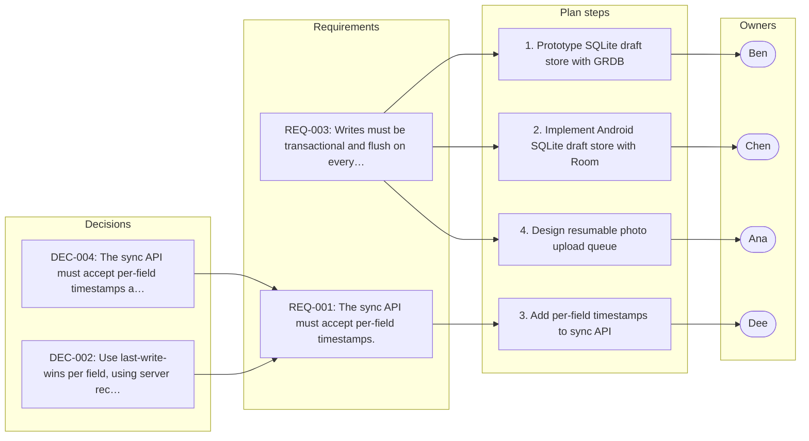

# Mobile Offline Mode Planning

_Generated by Planar on 2026-10-05 07:49 UTC._

## Decisions (6)

- **DEC-001** Use SQLite for local drafts on both platforms.
  > (Ana, L11–14) “Right. Let's settle storage first. I'd like us to store drafts locally in SQLite on both platforms, not in the platform key-value stores. … Okay, decision: SQLite for local drafts on both platforms, GRDB on iOS and Room on Android.”

- **DEC-002** Use last-write-wins per field, using server receive time for conflict resolution.
  > (L18–19) “Ana: That's too much for this cycle. Let's use last-write-wins per field, using the server receive time. We can revisit CRDTs next year. … Dee: Fine. Then the sync API must accept per-field timestamps and return the merged record.”

- **DEC-003** Photos should upload separately from form data in a resumable queue.
  > (L24–25) “Dee: Photos should upload separately from form data, in the background, and resume after interruption. The form sync shouldn't wait for photos. … Ana: Agreed, photos go through a separate resumable upload queue.”

- **DEC-004** The sync API must accept per-field timestamps and return merged records.
  > (L19–40) “Dee: Fine. Then the sync API must accept per-field timestamps and return the merged record. … Ana: Dee, add per-field timestamps to the sync API and write the merge endpoint. Done when two conflicting offline edits merge field by field and every overwrite is logged.”

- **DEC-005** Do not build CRDTs for conflict resolution in this cycle.
  > (L17–18) “Ben: We could do full CRDTs. … Ana: That's too much for this cycle. Let's use last-write-wins per field, using the server receive time. We can revisit CRDTs next year.”

- **DEC-006** The storage cap for device storage is pending data from MDM reports.
  > (L27–28) “Ana: I don't know yet. We need data on device storage across the fleet before we pick a cap. Eli, can you get that from the MDM reports? … Eli: Yes, I'll pull the device storage numbers from MDM by next Wednesday.”

## Requirements (4)

- **REQ-001** The sync API must accept per-field timestamps.
  - From: DEC-004, DEC-002
  > (Dee, L19) “Fine. Then the sync API must accept per-field timestamps and return the merged record.”

- **REQ-002** The app must never lose a draft when killed mid-save.
  > (Eli, L20) “One requirement from the customer side: a technician must never lose a draft, even if the app is killed mid-save.”

- **REQ-003** Writes must be transactional and flush on every field change.
  > (Ana, L21) “So writes have to be transactional and we flush on every field change, not on screen exit.”

- **REQ-004** The system must log every overwrite when conflicts occur.
  > (Dee, L32) “Yes, that's a real risk for long offline periods. We should at least log every overwrite so support can recover data.”

## Tasks (4)

- [ ] **TSK-001** Prototype the SQLite draft store with GRDB _(high; owner: Ben; due: Friday)_
  - Done when (suggested): Drafts survive an app crash
  > (Ana, L36) “Action items. Ben, prototype the SQLite draft store with GRDB, including crash-safe writes, by Friday.”

- [ ] **TSK-002** Implement the Android SQLite draft store with Room _(high; owner: Chen; due: Friday)_
  - Done when (suggested): Drafts survive an app crash
  > (Ana, L36) “Action items. Ben, prototype the SQLite draft store with GRDB, including crash-safe writes, by Friday.”

- [ ] **TSK-003** Add per-field timestamps to the sync API and write the merge endpoint _(high; owner: Dee; due: Thursday)_
  - Done when (suggested): Conflicting offline edits merge field by field
  - Done when (suggested): Every overwrite is logged
  - Implements: REQ-001
  > (Ana, L40) “Dee, add per-field timestamps to the sync API and write the merge endpoint. Done when two conflicting offline edits merge field by field and every overwrite is logged.”

- [ ] **TSK-004** Design the resumable photo upload queue _(high; owner: Ana)_
  > (Ana, L42) “And I'll design the resumable photo upload queue.”

## Risks (3)

- **RSK-001** [high] Device clocks being wrong could silently overwrite newer edits.
  > (Dee, L30) “Risk I see: if the clocks on devices are wrong, last-write-wins on device time will silently overwrite newer edits.”

- **RSK-002** [medium] Long offline periods could cause queued edits to clobber newer online edits.
  > (Ana, L31) “That's why we use server receive time, not device time. But queued edits from a phone that was offline for days could still clobber a newer edit made online.”

- **RSK-003** [medium] iOS background uploads might be killed if app is suspended too long.
  > (Ben, L33) “Another risk: iOS can kill background uploads if the app is suspended too long. Large photo queues might never finish.”

## Open questions (1)

- **OQ-001** Does the web app need offline mode?
  Sales keeps asking.
  > (Eli, L43) “Open item from my side: do we need offline mode for the admin web app too, or only mobile? Sales keeps asking. Nobody has decided that.”

## Implementation plan: Mobile Offline Mode Planning

This plan implements offline-first draft storage using SQLite with GRDB on iOS and Room on Android, with per-field timestamps for conflict resolution. Key constraints include last-write-wins conflict resolution, resumable photo uploads, and no CRDTs.

1. **Prototype SQLite draft store with GRDB** _(REQ-003, TSK-001)_
   Build a prototype draft store using GRDB for SQLite on iOS to validate the local storage model
2. **Implement Android SQLite draft store with Room** _(REQ-003, TSK-002)_
   Develop the Android draft store using Room to ensure consistent offline storage behavior
3. **Add per-field timestamps to sync API** _(REQ-001, TSK-003)_
   Modify the sync API to accept per-field timestamps and implement the merge endpoint for conflict resolution
4. **Design resumable photo upload queue** _(REQ-003, TSK-004)_
   Create a queue system for photos that handles resumable uploads without blocking form data

### Done when (suggested)

- [ ] All draft stores (iOS and Android) persist data transactionally and flush on every field change
- [ ] Sync API returns merged records with per-field timestamps for conflict resolution
- [ ] Photos upload in a resumable queue separate from form data
- [ ] Device clock errors do not cause silent overwrites due to last-write-wins policy
- [ ] App survives mid-save kills without losing drafts
- [ ] No CRDTs are implemented per DEC-005

## Plan map

Not tied to a single step; these apply to the plan as a whole:

- **DEC-001** Use SQLite for local drafts on both platforms.
- **DEC-003** Photos should upload separately from form data in a resumable queue.
- **DEC-005** Do not build CRDTs for conflict resolution in this cycle.
- **DEC-006** The storage cap for device storage is pending data from MDM reports.

Requirements not linked to any plan step:

- **REQ-002** The app must never lose a draft when killed mid-save.
- **REQ-004** The system must log every overwrite when conflicts occur.
