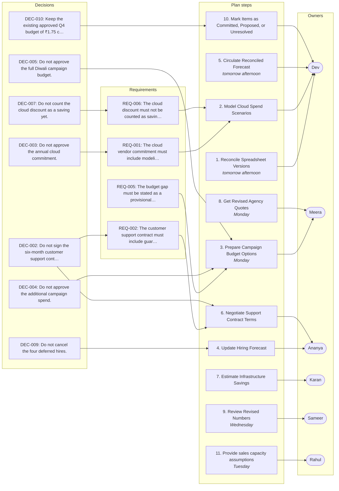

# Q4 Budget Review — Growth, Hiring & Infrastructure

_Generated by Planar on 2026-10-09 09:51 UTC._

## Decisions (10)

- **DEC-001** Do not approve the full six-role hiring plan.
  > (Priya, L96) “Ananya, update the hiring forecast for two immediate engineering hires and show the cash impact of deferring the remaining roles. … We will not approve the full six-role plan until we see both. …”

- **DEC-002** Do not sign the six-month customer support contract.
  > (Priya, L146) “Then don't sign the six-month contract yet. …”

- **DEC-003** Do not approve the annual cloud commitment.
  > (Dev, L190) “Only as a provisional comparison. The forecast includes unapproved campaign expansion, all six hires, and the unverified cloud commitment assumptions. It also doesn't yet reconcile contractor invoices.”

- **DEC-004** Do not approve the additional campaign spend.
  > (Priya, L208) “… We're not approving the additional campaign spend, the annual cloud commitment, the six-month support contract, or the full hiring plan today. …”

- **DEC-005** Do not approve the full Diwali campaign budget.
  > (Priya, L208) “We're keeping the existing approved Q4 budget of ₹1.75 crore as the control baseline. We're not approving the additional campaign spend, the annual cloud commitment, the six-month support contract, or the full hiring plan today. …”

- **DEC-006** Do not downgrade the security monitoring plan.
  > (Priya, L160) “Don't downgrade until Security confirms the retention requirements and the vendor clarifies the overage terms. Put that on the review list.”

- **DEC-007** Do not count the cloud discount as a saving yet.
  > (Karan, L194) “And the cloud discount shouldn't be counted as a saving until the minimum-spend analysis is complete.”

- **DEC-008** Do not count the second campaign tranche as approved.
  > (Meera, L198) “And the second campaign tranche isn't approved yet.”

- **DEC-009** Do not cancel the four deferred hires.
  > (Ananya, L202) “And the four deferred hires are still under review, not permanently cancelled.”

- **DEC-010** Keep the existing approved Q4 budget of ₹1.75 crore as the control baseline.
  > (Priya, L208) “We're keeping the existing approved Q4 budget of ₹1.75 crore as the control baseline. …”

## Requirements (8)

- **REQ-001** The cloud vendor commitment must include modeling minimum-spend risk.
  - From: DEC-003
  - Risks: RSK-002
  > (Priya, L118) “… Karan, ask the vendor for a lower minimum and confirm the actual expiry date. … I want that analysis before we make a commitment.”

- **REQ-002** The customer support contract must include guaranteed surge capacity.
  - From: DEC-002
  - Risks: RSK-004
  > (Priya, L146) “Then don't sign the six-month contract yet. Ananya, ask for a version with guaranteed surge capacity, cancellation terms, and explicit response-time commitments. …”

- **REQ-003** The security renewal must not be downgraded until retention requirements are confirmed.
  > (Priya, L160) “Don't downgrade until Security confirms the retention requirements and the vendor clarifies the overage terms. Put that on the review list.”

- **REQ-004** The travel budget must be split into customer visits, conference attendance, and other travel.
  > (Priya, L176) “… Rahul, split the ₹7 lakh into customer visits, conference attendance, and other travel. Give us a reduced option with two attendees and explain what customer coverage we would lose if we removed the conference entirely. …”

- **REQ-005** The budget gap must be stated as a provisional difference of ₹19 lakh.
  > (Priya, L192) “Fine. We can state that the current provisional forecast is ₹1.94 crore against a ₹1.75 crore approved budget, a provisional difference of ₹19 lakh. We cannot call that the final overspend.”

- **REQ-006** The cloud discount must not be counted as savings until minimum-spend analysis is complete.
  - From: DEC-007
  - Risks: RSK-002
  > (Karan, L194) “And the cloud discount shouldn't be counted as a saving until the minimum-spend analysis is complete.”

- **REQ-007** The security renewal must clarify overage terms before retention can be upgraded.
  > (Karan, L158) “Maybe, but I need to verify whether overage pricing is available and whether retention can be upgraded without migrating data.”

- **REQ-008** The cloud vendor must confirm the actual expiry date of the discount offer.
  > (Karan, L116) “We haven't asked yet. The vendor said the 12% offer expires on the 15th, but I haven't confirmed whether that's a hard deadline or a sales tactic.”

## Tasks (11)

- [ ] **TSK-001** Reconcile spreadsheet versions _(high; owner: Dev; due: tomorrow afternoon)_
  Dev, reconcile the two spreadsheet versions by tomorrow afternoon
  - Done when (suggested): Both versions reconciled
  - Done when (suggested): ₹1.94 crore figure is finalized
  > (Priya, L20) “That's why we're here. The board approved ₹1.75 crore for Q4 operating expenses. We need to understand the gap, not pretend the forecast is final. Dev, can you reconcile those two versions by tomorrow afternoon?”

- [ ] **TSK-002** Estimate infrastructure savings _(medium; owner: Karan)_
  Karan, ask the platform team to estimate the savings from scheduled shutdowns and identify any testing dependencies
  - Done when (suggested): Savings estimate provided
  - Done when (suggested): Testing dependencies identified
  > (Priya, L34) “Karan, ask the platform team to estimate the savings from scheduled shutdowns and identify any testing dependencies. Don't implement anything yet.”

- [ ] **TSK-003** Prepare campaign budget options _(high; owner: Meera; due: Monday)_
  Meera, prepare two options: the full ₹18 lakh plan and a ₹15 lakh alternative. Include the assumptions behind each, the proposed release conditions for the second tranche, and the refund-adjusted measurement method
  - Done when (suggested): Two campaign options prepared with assumptions and release conditions
  - Done when (suggested): Refund-adjusted measurement method included
  > (Priya, L64) “Meera, prepare two options: the full ₹18 lakh plan and a ₹15 lakh alternative. Include the assumptions behind each, the proposed release conditions for the second tranche, and the refund-adjusted measurement method. …”

- [ ] **TSK-004** Update hiring forecast _(medium; owner: Ananya)_
  Ananya, update the hiring forecast for two immediate engineering hires and show the cash impact of deferring the remaining roles
  - Done when (suggested): Revised hiring model with cash impact
  - Done when (suggested): Deferral impact clearly shown
  > (Priya, L96) “Ananya, update the hiring forecast for two immediate engineering hires and show the cash impact of deferring the remaining roles. … We will not approve the full six-role plan until we see both. …”

- [ ] **TSK-005** Provide sales capacity assumptions _(medium; owner: Rahul; due: Tuesday)_
  Rahul, provide the sales capacity assumptions and the impact of delaying the sales development representative
  - Done when (suggested): Sales capacity assumptions provided
  - Done when (suggested): Impact of delaying sales development representative explained
  > (Priya, L96) “Ananya, update the hiring forecast for two immediate engineering hires and show the cash impact of deferring the remaining roles. Rahul, provide the sales capacity assumptions and the impact of delaying the sales development representative. …”

- [ ] **TSK-006** Model cloud spend scenarios _(high; owner: Dev)_
  Dev, model three cases: current run rate, optimized run rate, and a 15% usage decline. Include the shortfall charge and the net savings in each case
  - Done when (suggested): Three cloud spend cases modeled
  - Done when (suggested): Shortfall charge and net savings included in each
  - Implements: REQ-001
  > (Priya, L118) “… Dev, model three cases: current run rate, optimized run rate, and a 15% usage decline. Include the shortfall charge and the net savings in each case. …”

- [ ] **TSK-007** Get revised agency quotes _(medium; owner: Meera; due: Monday)_
  Meera, get revised quotes for both campaign scopes and confirm which costs are already included in the budget model
  - Done when (suggested): Revised agency quotes for both campaign scopes
  - Done when (suggested): Costs included in budget model confirmed
  > (Priya, L134) “Meera, get revised quotes for both campaign scopes and confirm which costs are already included in the budget model. Please do that by Monday so we don't count the agency fee twice.”

- [ ] **TSK-008** Negotiate support contract terms _(medium; owner: Ananya)_
  Ananya, ask for a version with guaranteed surge capacity, cancellation terms, and explicit response-time commitments. Compare that with staying monthly
  - Done when (suggested): Support contract terms with surge capacity and cancellation terms
  - Done when (suggested): Comparison with monthly arrangement provided
  - Implements: REQ-002
  > (Priya, L146) “… Ananya, ask for a version with guaranteed surge capacity, cancellation terms, and explicit response-time commitments. Compare that with staying monthly. …”

- [ ] **TSK-009** Circulate reconciled forecast _(high; owner: Dev; due: tomorrow afternoon)_
  Dev, circulate the reconciled forecast tomorrow afternoon, assuming Procurement sends the renewal schedule today
  - Done when (suggested): Reconciled forecast circulated
  - Done when (suggested): Renewal schedule received from Procurement
  > (Dev, L210) “I'll circulate the reconciled forecast tomorrow afternoon, assuming Procurement sends the renewal schedule today.”

- [ ] **TSK-010** Mark items as committed, proposed, or unresolved _(medium; owner: Dev)_
  Dev, please mark each item as committed, proposed, or unresolved. Don't quietly turn proposed savings into approved reductions
  - Done when (suggested): All items marked as committed, proposed, or unresolved
  - Done when (suggested): No proposed savings turned into approved reductions
  > (Priya, L212) “And please mark each item as committed, proposed, or unresolved. Don't quietly turn proposed savings into approved reductions.”

- [ ] **TSK-011** Review revised numbers _(medium; owner: Sameer; due: Wednesday)_
  Sameer, let's review the revised numbers on Wednesday. If the gap is still there, we'll decide which proposals to approve, defer, or reject
  - Done when (suggested): Revised numbers reviewed on Wednesday
  - Done when (suggested): Decisions on proposals made if gap remains
  > (Sameer, L214) “Fine. Let's review the revised numbers on Wednesday. If the gap is still there, we'll decide which proposals to approve, defer, or reject.”

## Risks (10)

- **RSK-001** [medium] The staging cluster shutdown could disrupt overnight integration tests.
  > (Karan, L28–32) “… The staging cluster is costing approximately ₹1.2 lakh a month. We could shut it down outside working hours, but I haven't checked whether that would interfere with overnight integration tests. … Maybe. I'd want the platform team to check the test schedule first. If we shut it down blindly, we'll save money and then spend two days debugging failed deployments.”

- **RSK-002** [high] The cloud discount could be erased if we miss the minimum spend.
  - Affects: REQ-006, REQ-001
  > (L110–112) “Karan: The current run rate annualizes to around ₹1.02 crore, but that assumes the December forecast is representative. If we optimize the staging cluster and reduce unused storage, actual spend could fall below ₹90 lakh. … Dev: And the shortfall charge could erase the discount. We need to model the minimum-spend risk rather than comparing the headline discount to list price.”

- **RSK-003** [medium] The agency fee increase could inflate the campaign budget if the full scope is approved.
  > (Priya, L134) “Meera, get revised quotes for both campaign scopes and confirm which costs are already included in the budget model. Please do that by Monday so we don't count the agency fee twice.”

- **RSK-004** [medium] The six-month customer support contract could lack guaranteed surge capacity.
  - Affects: REQ-002
  > (L142–146) “Sameer: Can the vendor guarantee extra capacity if the campaign performs well? … Priya: Then don't sign the six-month contract yet. Ananya, ask for a version with guaranteed surge capacity, cancellation terms, and explicit response-time commitments. …”

- **RSK-005** [medium] The cheaper security plan could fail to retain enough data for audits.
  > (Karan, L154) “Usually around 70% of the current limit, although during incidents we sometimes exceed that. I haven't checked whether the cheaper plan retains enough data for our audit requirements.”

- **RSK-006** [medium] The insurance renewal is only partially recognized as Q4 expense.
  > (L180–182) “Dev: … The ₹3.6 lakh annual insurance renewal falls due in November. It's in the cash forecast, but only one quarter of it should be recognized as Q4 expense under our current accounting treatment. … Priya: Good. Make sure the budget comparison distinguishes cash paid from expense recognized. We keep mixing those numbers.”

- **RSK-007** [medium] The campaign's second tranche could be overestimated without confirmed metrics.
  > (Priya, L64) “… Include the assumptions behind each, the proposed release conditions for the second tranche, and the refund-adjusted measurement method. …”

- **RSK-008** [medium] The sales team might struggle with increased leads without a reliable capacity model.
  > (Rahul, L94) “Possibly, but response times may increase. I don't have a reliable capacity model yet.”

- **RSK-009** [medium] Deferred hiring could delay critical projects like the analytics migration.
  > (Karan, L74) “We need the data engineer. The analytics migration is already taking time away from two backend engineers. If we don't hire, the migration could slip into next quarter.”

- **RSK-010** [medium] The annual software renewal could be double-counted if not reconciled.
  > (L14–16) “Priya: … Before anyone panics, that might include the annual software renewal twice. … Dev: … One version has the annual renewal under October expenses, and the other has it under prepaid expenses. … I haven't reconciled the contractor invoices yet, so the ₹1.94 crore figure is provisional.”

## Open questions (7)

- **OQ-001** What conversion rate and customer acquisition cost thresholds are acceptable?
  Campaign metrics are not finalized.
  > (Meera, L58) “I haven't finalized the threshold. We'd need to agree on a minimum conversion rate and customer acquisition cost.”

- **OQ-002** Whether to sign the six-month customer support contract?
  Deferred until the analysis is reviewed.
  > (Priya, L146) “Then don't sign the six-month contract yet. …”

- **OQ-003** Whether to cut the conference entirely?
  Left undecided in the meeting.
  > (Sameer, L172) “I'd rather cut the conference entirely until the pipeline improves.”

- **OQ-004** Whether to downgrade the security monitoring plan?
  Deferred until the analysis is reviewed.
  > (Priya, L160) “Don't downgrade until Security confirms the retention requirements and the vendor clarifies the overage terms. Put that on the review list.”

- **OQ-005** Whether to model minimum-spend risk for the cloud vendor commitment?
  Deferred until the analysis is reviewed.
  > (Priya, L118) “… Karan, ask the vendor for a lower minimum and confirm the actual expiry date. … I want that analysis before we make a commitment.”

- **OQ-006** Whether to upgrade retention on the security renewal?
  Deferred until the analysis is reviewed.
  > (Karan, L158) “Maybe, but I need to verify whether overage pricing is available and whether retention can be upgraded without migrating data.”

- **OQ-007** Whether to confirm the actual expiry date of the cloud discount offer?
  Deferred until the analysis is reviewed.
  > (Karan, L116) “We haven't asked yet. The vendor said the 12% offer expires on the 15th, but I haven't confirmed whether that's a hard deadline or a sales tactic.”

## Implementation plan: Q4 Budget Review — Growth, Hiring & Infrastructure

11 implementation steps covering 8 requirements and 11 tasks.

1. **Reconcile Spreadsheet Versions** · tomorrow afternoon _(TSK-001)_
   Dev will reconcile the two spreadsheet versions to ensure consistency.
2. **Model Cloud Spend Scenarios** _(REQ-001, REQ-006, TSK-006)_
   Dev will model three cloud spend scenarios to assess minimum-spend risk.
3. **Prepare Campaign Budget Options** · Monday _(DEC-004, DEC-005, REQ-005, TSK-003)_
   Meera will prepare two campaign budget options with assumptions and release conditions.
4. **Update Hiring Forecast** _(DEC-009, TSK-004)_
   Ananya will update the hiring forecast and show the cash impact of deferring roles.
5. **Circulate Reconciled Forecast** · tomorrow afternoon _(TSK-009)_
   Dev will circulate the reconciled forecast assuming Procurement sends the renewal schedule.
6. **Negotiate Support Contract Terms** _(DEC-002, REQ-002, TSK-008)_
   Ananya will negotiate the support contract to include guaranteed surge capacity.
7. **Estimate Infrastructure Savings** _(TSK-002)_
   Karan will estimate savings from scheduled shutdowns and testing dependencies.
8. **Get Revised Agency Quotes** · Monday _(TSK-007)_
   Meera will get revised quotes for campaign scopes and confirm included costs.
9. **Review Revised Numbers** · Wednesday _(TSK-011)_
   Sameer will review revised numbers to decide on proposals.
10. **Mark Items as Committed, Proposed, or Unresolved** _(DEC-010, TSK-010)_
   Dev will categorize each item as committed, proposed, or unresolved.
11. **Provide sales capacity assumptions** · Tuesday _(TSK-005)_
   Rahul, provide the sales capacity assumptions and the impact of delaying the sales development representative

### Done when (suggested)

- [ ] Both versions reconciled
- [ ] ₹1.94 crore figure is finalized
- [ ] Three cloud spend cases modeled
- [ ] Shortfall charge and net savings included in each
- [ ] Two campaign options prepared with assumptions and release conditions
- [ ] Refund-adjusted measurement method included
- [ ] Revised hiring model with cash impact
- [ ] Deferral impact clearly shown
- [ ] Reconciled forecast circulated
- [ ] Renewal schedule received from Procurement
- [ ] Support contract terms with surge capacity and cancellation terms
- [ ] Comparison with monthly arrangement provided
- [ ] Savings estimate provided
- [ ] Testing dependencies identified
- [ ] Revised agency quotes for both campaign scopes
- [ ] Costs included in budget model confirmed
- [ ] Revised numbers reviewed on Wednesday
- [ ] Decisions on proposals made if gap remains
- [ ] All items marked as committed, proposed, or unresolved
- [ ] No proposed savings turned into approved reductions

## Plan map

Not tied to a single step; these apply to the plan as a whole:

- **DEC-001** Do not approve the full six-role hiring plan.
- **DEC-006** Do not downgrade the security monitoring plan.
- **DEC-008** Do not count the second campaign tranche as approved.

Requirements not linked to any plan step:

- **REQ-003** The security renewal must not be downgraded until retention requirements are confirmed.
- **REQ-004** The travel budget must be split into customer visits, conference attendance, and other travel.
- **REQ-007** The security renewal must clarify overage terms before retention can be upgraded.
- **REQ-008** The cloud vendor must confirm the actual expiry date of the discount offer.
