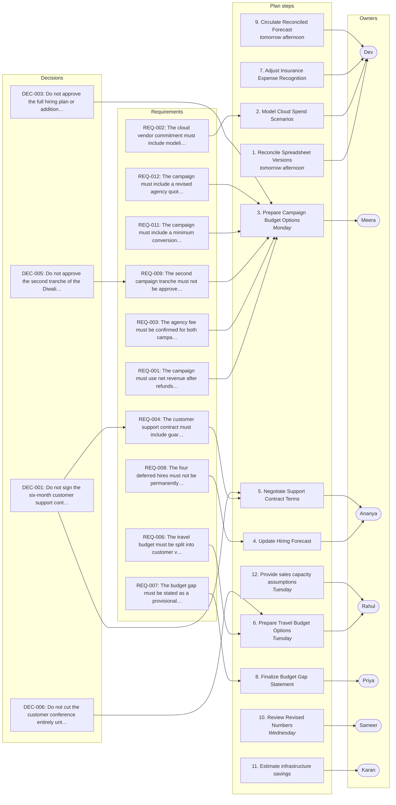

# Q4 Budget Review — Growth, Hiring & Infrastructure

_Generated by Planar on 2026-10-09 07:04 UTC._

## Decisions (7)

- **DEC-001** Do not sign the six-month customer support contract yet.
  > (Priya, L146) “Then don't sign the six-month contract yet. …”

- **DEC-002** Do not downgrade the security monitoring plan until confirmed.
  > (Priya, L160) “Don't downgrade until Security confirms the retention requirements and the vendor clarifies the overage terms. Put that on the review list.”

- **DEC-003** Do not approve the full hiring plan or additional campaign spend.
  > (Priya, L208) “… We're not approving the additional campaign spend, the annual cloud commitment, the six-month support contract, or the full hiring plan today. The two immediate engineering hires will be modeled as the proposed first hiring tranche, but we still need to review the revised forecast before final authorization.”

- **DEC-004** Do not count the cloud discount as a saving until analysis is complete.
  > (Karan, L194) “And the cloud discount shouldn't be counted as a saving until the minimum-spend analysis is complete.”

- **DEC-005** Do not approve the second tranche of the Diwali campaign budget.
  > (Meera, L198) “And the second campaign tranche isn't approved yet.”

- **DEC-006** Do not cut the customer conference entirely until pipeline improves.
  > (Sameer, L172) “I'd rather cut the conference entirely until the pipeline improves.”

- **DEC-007** Do not build a separate service for the staging cluster.
  > (Karan, L28) “Traffic growth, more historical data, and the staging environment we added for the migration. The staging cluster is costing approximately ₹1.2 lakh a month. …”

## Requirements (12)

- **REQ-001** The campaign must use net revenue after refunds for measurement.
  > (Meera, L62) “Correct. We should use net revenue after refunds, but I need to confirm how quickly the data becomes reliable.”

- **REQ-002** The cloud vendor commitment must include modeling minimum-spend risk.
  - Risks: RSK-002
  > (Priya, L118) “… Karan, ask the vendor for a lower minimum and confirm the actual expiry date. … I want that analysis before we make a commitment.”

- **REQ-003** The agency fee must be confirmed for both campaign scopes.
  > (Priya, L134) “Meera, get revised quotes for both campaign scopes and confirm which costs are already included in the budget model. Please do that by Monday so we don't count the agency fee twice.”

- **REQ-004** The customer support contract must include guaranteed surge capacity.
  - From: DEC-001
  - Risks: RSK-007
  > (Priya, L146) “Then don't sign the six-month contract yet. Ananya, ask for a version with guaranteed surge capacity, cancellation terms, and explicit response-time commitments. …”

- **REQ-005** The security renewal must not be downgraded until retention requirements are confirmed.
  - From: DEC-002
  > (Priya, L160) “Don't downgrade until Security confirms the retention requirements and the vendor clarifies the overage terms. Put that on the review list.”

- **REQ-006** The travel budget must be split into customer visits, conference attendance, and other travel.
  - Risks: RSK-004
  > (Priya, L176) “… Rahul, split the ₹7 lakh into customer visits, conference attendance, and other travel. Give us a reduced option with two attendees and explain what customer coverage we would lose if we removed the conference entirely. …”

- **REQ-007** The budget gap must be stated as a provisional difference of ₹19 lakh.
  > (Priya, L192) “Fine. We can state that the current provisional forecast is ₹1.94 crore against a ₹1.75 crore approved budget, a provisional difference of ₹19 lakh. We cannot call that the final overspend.”

- **REQ-008** The four deferred hires must not be permanently cancelled.
  > (Ananya, L202) “And the four deferred hires are still under review, not permanently cancelled.”

- **REQ-009** The second campaign tranche must not be approved until revised quotes are confirmed.
  - From: DEC-005
  > (Meera, L198) “And the second campaign tranche isn't approved yet.”

- **REQ-010** The security renewal must clarify overage terms before downgrading.
  > (Priya, L160) “Don't downgrade until Security confirms the retention requirements and the vendor clarifies the overage terms. Put that on the review list.”

- **REQ-011** The campaign must include a minimum conversion rate and customer acquisition cost threshold.
  > (Meera, L58) “I haven't finalized the threshold. We'd need to agree on a minimum conversion rate and customer acquisition cost.”

- **REQ-012** The campaign must include a revised agency quote for the ₹15 lakh alternative.
  > (Priya, L134) “Meera, get revised quotes for both campaign scopes and confirm which costs are already included in the budget model. Please do that by Monday so we don't count the agency fee twice.”

## Tasks (13)

- [ ] **TSK-001** Reconcile spreadsheet versions _(high; owner: Dev; due: tomorrow afternoon)_
  Dev will reconcile the two spreadsheet versions by tomorrow afternoon
  - Done when (suggested): Reconciled versions
  - Done when (suggested): Contractor invoices reconciled
  > (Priya, L20) “That's why we're here. The board approved ₹1.75 crore for Q4 operating expenses. We need to understand the gap, not pretend the forecast is final. Dev, can you reconcile those two versions by tomorrow afternoon?”

- [ ] **TSK-002** Estimate infrastructure savings _(medium; owner: Karan)_
  Karan will ask the platform team to estimate the savings from scheduled shutdowns and identify any testing dependencies
  - Done when (suggested): Savings estimate
  - Done when (suggested): Testing dependencies identified
  > (Priya, L34) “Karan, ask the platform team to estimate the savings from scheduled shutdowns and identify any testing dependencies. Don't implement anything yet.”

- [ ] **TSK-003** Prepare campaign budget options _(high; owner: Meera; due: Monday)_
  Meera will prepare two options: the full ₹18 lakh plan and a ₹15 lakh alternative, including assumptions, release conditions, and refund-adjusted measurement method
  - Done when (suggested): Full ₹18 lakh plan
  - Done when (suggested): ₹15 lakh alternative
  - Implements: REQ-012
  > (Priya, L64) “Meera, prepare two options: the full ₹18 lakh plan and a ₹15 lakh alternative. Include the assumptions behind each, the proposed release conditions for the second tranche, and the refund-adjusted measurement method. …”

- [ ] **TSK-004** Update hiring forecast _(medium; owner: Ananya)_
  Ananya will update the hiring forecast for two immediate engineering hires and show the cash impact of deferring the remaining roles
  - Done when (suggested): Revised hiring model
  - Done when (suggested): Cash impact of deferrals
  > (Priya, L96) “Ananya, update the hiring forecast for two immediate engineering hires and show the cash impact of deferring the remaining roles. … We will not approve the full six-role plan until we see both. …”

- [ ] **TSK-005** Provide sales capacity assumptions _(medium; owner: Rahul; due: Tuesday)_
  Rahul will provide the sales capacity assumptions and the impact of delaying the sales development representative
  - Done when (suggested): Sales capacity assumptions
  - Done when (suggested): Impact of delay
  > (Priya, L96) “Ananya, update the hiring forecast for two immediate engineering hires and show the cash impact of deferring the remaining roles. Rahul, provide the sales capacity assumptions and the impact of delaying the sales development representative. …”

- [ ] **TSK-006** Model cloud spend scenarios _(high; owner: Dev)_
  Dev will model three cases: current run rate, optimized run rate, and a 15% usage decline, including shortfall charge and net savings
  - Done when (suggested): Current run rate
  - Done when (suggested): Optimized run rate
  - Done when (suggested): 15% usage decline
  > (Priya, L118) “… Dev, model three cases: current run rate, optimized run rate, and a 15% usage decline. Include the shortfall charge and the net savings in each case. …”

- [ ] **TSK-007** Get revised agency quotes _(medium; owner: Meera; due: Monday)_
  Meera will get revised quotes for both campaign scopes and confirm which costs are already included in the budget model
  - Done when (suggested): Revised agency quotes
  - Done when (suggested): Costs included in budget model
  - Implements: REQ-003, REQ-012
  > (L130–134) “Meera: Yes, but only if we keep the full campaign. The ₹15 lakh alternative assumes a smaller scope, so I need a revised agency quote for that option. … Priya: Meera, get revised quotes for both campaign scopes and confirm which costs are already included in the budget model. Please do that by Monday so we don't count the agency fee twice.”

- [ ] **TSK-008** Negotiate support contract terms _(medium; owner: Ananya)_
  Ananya will ask for a version of the customer support contract with guaranteed surge capacity, cancellation terms, and explicit response-time commitments
  - Done when (suggested): Guaranteed surge capacity
  - Done when (suggested): Cancellation terms
  - Done when (suggested): Response-time commitments
  - Implements: REQ-004
  > (Priya, L146) “Then don't sign the six-month contract yet. Ananya, ask for a version with guaranteed surge capacity, cancellation terms, and explicit response-time commitments. …”

- [ ] **TSK-009** Prepare travel budget options _(medium; owner: Rahul; due: Tuesday)_
  Rahul will split the ₹7 lakh into customer visits, conference attendance, and other travel, and explain customer coverage lost if the conference is removed
  - Done when (suggested): Split ₹7 lakh into categories
  - Done when (suggested): Customer coverage explanation
  - Implements: REQ-006
  > (Priya, L176) “… Rahul, split the ₹7 lakh into customer visits, conference attendance, and other travel. Give us a reduced option with two attendees and explain what customer coverage we would lose if we removed the conference entirely. …”

- [ ] **TSK-010** Adjust insurance expense recognition _(medium; owner: Dev)_
  Dev will add separate cash and P&L columns to the reconciled forecast
  - Done when (suggested): Cash and P&L columns added
  > (L182–184) “Priya: Good. Make sure the budget comparison distinguishes cash paid from expense recognized. We keep mixing those numbers. … Dev: I'll add separate cash and P&L columns to the reconciled forecast. That should also help with the annual software renewal.”

- [ ] **TSK-011** Finalize budget gap statement _(medium; owner: Priya)_
  Priya will state the provisional budget gap as ₹19 lakh against the approved ₹1.75 crore
  - Done when (suggested): Provisional budget gap of ₹19 lakh
  - Implements: REQ-007
  > (L188–192) “Sameer: We need a final answer on the budget gap. If the approved budget is ₹1.75 crore and the forecast is ₹1.94 crore, that's a ₹19 lakh gap. Can we say the gap is ₹19 lakh for now? … Priya: Fine. We can state that the current provisional forecast is ₹1.94 crore against a ₹1.75 crore approved budget, a provisional difference of ₹19 lakh. We cannot call that the final overspend.”

- [ ] **TSK-012** Circulate reconciled forecast _(high; owner: Dev; due: tomorrow afternoon)_
  Dev will circulate the reconciled forecast tomorrow afternoon
  - Done when (suggested): Reconciled forecast circulated
  > (Dev, L210) “I'll circulate the reconciled forecast tomorrow afternoon, assuming Procurement sends the renewal schedule today.”

- [ ] **TSK-013** Review revised numbers _(medium; owner: Sameer; due: Wednesday)_
  Sameer will review the revised numbers on Wednesday
  - Done when (suggested): Revised numbers reviewed
  > (Sameer, L214) “Fine. Let's review the revised numbers on Wednesday. If the gap is still there, we'll decide which proposals to approve, defer, or reject.”

## Risks (8)

- **RSK-001** [medium] Shutting down the staging cluster could cause failed deployments and debugging costs.
  > (L30–32) “Sameer: Can we just shut it down at night? … Karan: Maybe. I'd want the platform team to check the test schedule first. If we shut it down blindly, we'll save money and then spend two days debugging failed deployments.”

- **RSK-002** [high] Cloud discount could be lost if minimum spend is not met.
  - Affects: REQ-002
  > (Dev, L112) “And the shortfall charge could erase the discount. We need to model the minimum-spend risk rather than comparing the headline discount to list price.”

- **RSK-003** [medium] Reduced cloud retention could fail audit requirements.
  > (Karan, L154) “Usually around 70% of the current limit, although during incidents we sometimes exceed that. I haven't checked whether the cheaper plan retains enough data for our audit requirements.”

- **RSK-004** [medium] Conference attendance may not generate enough new leads to justify cost.
  - Affects: REQ-006
  > (Priya, L176) “… Rahul, split the ₹7 lakh into customer visits, conference attendance, and other travel. Give us a reduced option with two attendees and explain what customer coverage we would lose if we removed the conference entirely. …”

- **RSK-005** [medium] Deferred hiring may increase short-term recruitment costs.
  > (Ananya, L80) “The recruiter is also intended to reduce external sourcing costs. If we postpone that position, we might pay more agencies in the short term.”

- **RSK-006** [medium] Uncertain contractor invoice reconciliation could delay budget accuracy.
  > (Dev, L16) “… I haven't reconciled the contractor invoices yet, so the ₹1.94 crore figure is provisional.”

- **RSK-007** [medium] Customer support contract changes may not guarantee surge capacity or response times.
  - Affects: REQ-004
  > (L142–144) “Sameer: Can the vendor guarantee extra capacity if the campaign performs well? … Ananya: They said they can usually add agents within two weeks, but that isn't a contractual guarantee. We haven't negotiated service-level terms for the longer contract.”

- **RSK-008** [medium] Insurance expense recognition may be misaligned with cash payments.
  > (L180–182) “Dev: … The ₹3.6 lakh annual insurance renewal falls due in November. It's in the cash forecast, but only one quarter of it should be recognized as Q4 expense under our current accounting treatment. … Priya: Good. Make sure the budget comparison distinguishes cash paid from expense recognized. We keep mixing those numbers.”

## Open questions (2)

- **OQ-001** What conversion rate and customer acquisition cost thresholds are acceptable?
  Campaign budget adjustment.
  > (Meera, L58) “I haven't finalized the threshold. We'd need to agree on a minimum conversion rate and customer acquisition cost.”

- **OQ-002** What is the exact impact of reducing the campaign budget to ₹15 lakh?
  Marketing budget adjustment.
  > (Sameer, L52) “Could we cut the campaign to ₹15 lakh and keep the same target?”

## Implementation plan: Q4 Budget Review — Growth, Hiring & Infrastructure

12 implementation steps covering 12 requirements and 13 tasks.

1. **Reconcile Spreadsheet Versions** · tomorrow afternoon _(TSK-001)_
   Dev will reconcile the two spreadsheet versions to ensure consistency.
2. **Model Cloud Spend Scenarios** _(REQ-002, TSK-006)_
   Dev will model three cloud spend scenarios to assess savings and risks.
3. **Prepare Campaign Budget Options** · Monday _(DEC-003, REQ-001, REQ-003, REQ-009, REQ-011, REQ-012, TSK-003, TSK-007)_
   Meera will prepare two campaign budget options including refund-adjusted measurement.
4. **Update Hiring Forecast** _(REQ-008, TSK-004)_
   Ananya will update the hiring forecast and show the cash impact of deferrals.
5. **Negotiate Support Contract Terms** _(DEC-001, REQ-004, TSK-008)_
   Ananya will negotiate the customer support contract with surge capacity guarantees.
6. **Prepare Travel Budget Options** · Tuesday _(DEC-006, REQ-006, TSK-009)_
   Rahul will split the travel budget into customer visits, conference attendance, and other travel.
7. **Adjust Insurance Expense Recognition** _(TSK-010)_
   Dev will adjust insurance expense recognition to include separate cash and P&L columns.
8. **Finalize Budget Gap Statement** _(REQ-007, TSK-011)_
   Priya will finalize the budget gap statement as a provisional ₹19 lakh difference.
9. **Circulate Reconciled Forecast** · tomorrow afternoon _(TSK-012)_
   Dev will circulate the reconciled forecast to all stakeholders.
10. **Review Revised Numbers** · Wednesday _(TSK-013)_
   Sameer will review all revised numbers to ensure alignment with constraints and requirements.
11. **Estimate infrastructure savings** _(TSK-002)_
   Karan will ask the platform team to estimate the savings from scheduled shutdowns and identify any testing dependencies
12. **Provide sales capacity assumptions** · Tuesday _(TSK-005)_
   Rahul will provide the sales capacity assumptions and the impact of delaying the sales development representative

### Done when

- [ ] Do not sign the six-month customer support contract yet.
- [ ] Do not downgrade the security monitoring plan until confirmed.
- [ ] The security renewal must not be downgraded until retention requirements are confirmed.
- [ ] Do not approve the full hiring plan or additional campaign spend.
- [ ] The four deferred hires must not be permanently cancelled.
- [ ] Do not count the cloud discount as a saving until analysis is complete.
- [ ] The cloud vendor commitment must include modeling minimum-spend risk.
- [ ] Do not approve the second tranche of the Diwali campaign budget.
- [ ] The second campaign tranche must not be approved until revised quotes are confirmed.
- [ ] Do not cut the customer conference entirely until pipeline improves.
- [ ] The travel budget must be split into customer visits, conference attendance, and other travel.

## Plan map

Not tied to a single step; these apply to the plan as a whole:

- **DEC-002** Do not downgrade the security monitoring plan until confirmed.
- **DEC-004** Do not count the cloud discount as a saving until analysis is complete.
- **DEC-007** Do not build a separate service for the staging cluster.

Requirements not linked to any plan step:

- **REQ-005** The security renewal must not be downgraded until retention requirements are confirmed.
- **REQ-010** The security renewal must clarify overage terms before downgrading.
