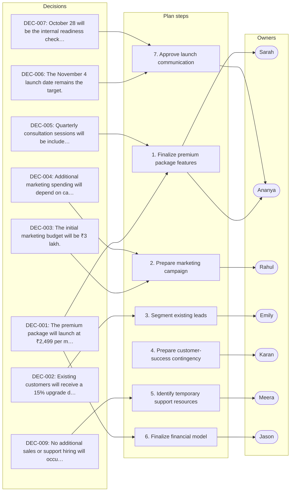

# Quarterly Product Launch Planning Meeting

_Generated by Planar on 2026-10-05 11:53 UTC._

## Decisions (10)

- **DEC-001** The premium package will launch at ₹2,499 per month.
  > (L202) “1. The premium package will launch at ₹2,499 per month.”

- **DEC-002** Existing customers will receive a 15% upgrade discount for 30 days.
  > (L203) “2. Existing customers will receive a 15% upgrade discount for 30 days.”

- **DEC-003** The initial marketing budget will be ₹3 lakh.
  > (L204) “3. The initial marketing budget will be ₹3 lakh.”

- **DEC-004** Additional marketing spending will depend on campaign performance.
  > (L205) “4. Additional marketing spending will depend on campaign performance.”

- **DEC-005** Quarterly consultation sessions will be included in the premium package.
  > (L206) “5. Quarterly consultation sessions will be included in the premium package.”

- **DEC-006** The November 4 launch date remains the target.
  > (L207) “6. The November 4 launch date remains the target.”

- **DEC-007** October 28 will be the internal readiness checkpoint.
  > (L208) “7. October 28 will be the internal readiness checkpoint.”

- **DEC-008** If the critical feature is not stable by October 28, the launch will move to November 11.
  > (L209) “8. If the critical feature is not stable by October 28, the launch will move to November 11.”

- **DEC-009** No additional sales or support hiring will occur before launch.
  > (L210) “9. No additional sales or support hiring will occur before launch.”

- **DEC-010** Launch performance will be evaluated primarily over the first 30 days.
  > (L211) “10. Launch performance will be evaluated primarily over the first 30 days.”

## Requirements (0)

## Tasks (7)

- [ ] **TSK-001** Finalize premium package feature list _(high; owner: Sarah; due: October 28 readiness review)_
  Finalize the premium package feature list and coordinate the October 28 readiness review
  - Done when (suggested): Premium package feature list finalized
  - Done when (suggested): October 28 readiness review coordinated
  > (Sarah, L217) “Finalize the premium package feature list and coordinate the October 28 readiness review.”

- [ ] **TSK-002** Prepare first-stage marketing campaign _(medium; owner: Rahul)_
  Prepare the first-stage ₹3 lakh marketing campaign and define performance thresholds for additional spending
  - Done when (suggested): First-stage ₹3 lakh marketing campaign prepared
  - Done when (suggested): Performance thresholds for additional spending defined
  > (Rahul, L219) “Prepare the first-stage ₹3 lakh marketing campaign and define performance thresholds for additional spending.”

- [ ] **TSK-003** Segment existing leads _(medium; owner: Emily)_
  Segment the 120 existing leads and create the corresponding outreach strategy
  - Done when (suggested): 120 existing leads segmented
  - Done when (suggested): Corresponding outreach strategy created
  > (Emily, L221) “Segment the 120 existing leads and create the corresponding outreach strategy.”

- [ ] **TSK-004** Prepare customer-success contingency plan _(medium; owner: Karan)_
  Prepare the customer-success contingency plan and premium onboarding documentation
  - Done when (suggested): Customer-success contingency plan prepared
  - Done when (suggested): Premium onboarding documentation prepared
  > (Karan, L223) “Prepare the customer-success contingency plan and premium onboarding documentation.”

- [ ] **TSK-005** Identify temporary support resources _(medium; owner: Meera)_
  Identify potential temporary support resources without committing to additional hiring
  - Done when (suggested): Potential temporary support resources identified
  - Done when (suggested): No additional hiring committed
  > (Meera, L225) “Identify potential temporary support resources without committing to additional hiring.”

- [ ] **TSK-006** Finalize financial model _(medium; owner: Jason)_
  Finalize the financial model and establish acceptable customer acquisition cost thresholds
  - Done when (suggested): Financial model finalized
  - Done when (suggested): Acceptable customer acquisition cost thresholds established
  > (Jason, L227) “Finalize the financial model and establish acceptable customer acquisition cost thresholds.”

- [ ] **TSK-007** Approve launch communication _(high; owner: Ananya; due: October 28 readiness assessment)_
  Approve the final launch communication and review the October 28 readiness assessment
  - Done when (suggested): Final launch communication approved
  - Done when (suggested): October 28 readiness assessment reviewed
  > (Ananya, L229) “Approve the final launch communication and review the October 28 readiness assessment.”

## Risks (5)

- **RSK-001** [medium] Customer support team could not handle more than approximately 50 new premium accounts in the first month.
  > (L160) “Karan estimated that the team could comfortably support approximately 50 new premium accounts during the first month.”

- **RSK-002** [high] Launch might be delayed if critical product feature is not stable by October 28.
  > (L124) “If the critical feature is not stable by that date, the launch will move to November 11.”

- **RSK-003** [medium] Sales team might need temporary staff if lead volume increases significantly after launch.
  > (L96) “Emily said the team could manage it for the first month but might need temporary assistance if lead volume increases significantly.”

- **RSK-004** [medium] Marketing campaign might not generate sufficient awareness if budget is too low.
  > (L68) “Rahul argued that a smaller campaign would limit the company's ability to generate sufficient awareness and could make the launch appear unsuccessful even if the product itself performed well.”

- **RSK-005** [medium] Pricing could be perceived as too high by customers if additional value is not clear.
  > (L22) “… Some customers considered the difference reasonable, while others felt the premium package did not provide enough additional value.”

## Open questions (1)

- **OQ-001** Can the customer-success team handle increased demand if launch exceeds expectations?
  Operational concerns about support capacity.
  > (L158) “If the launch performs significantly better than expected, the customer-success team could receive a large increase in support requests.”

## Implementation plan: Quarterly Product Launch Planning Meeting

This plan implements the premium package launch with ₹2,499/month pricing, 15% upgrade discount for existing customers, and a ₹3 lakh marketing budget. Key constraints include the November 4 launch target, October 28 readiness checkpoint, and performance evaluation within the first 30 days post-launch.

1. **Finalize premium package features** _(DEC-001, DEC-005, TSK-001, TSK-007)_
   Complete feature list for premium package and coordinate readiness review
2. **Prepare marketing campaign** _(DEC-003, DEC-004, TSK-002)_
   Develop first-stage ₹3 lakh marketing campaign and define performance thresholds for additional spending
3. **Segment existing leads** _(DEC-002, TSK-003)_
   Segment 120 existing leads and create outreach strategy for upgrade discount
4. **Prepare customer-success contingency** _(TSK-004)_
   Develop contingency plan and onboarding documentation for premium package
5. **Identify temporary support resources** _(DEC-009, TSK-005)_
   Find potential temporary support resources without hiring
6. **Finalize financial model** _(DEC-001, TSK-006)_
   Establish financial model and acceptable customer acquisition cost thresholds
7. **Approve launch communication** _(DEC-006, DEC-007, TSK-007)_
   Finalize and review launch communication against October 28 readiness assessment

### Done when (suggested)

- [ ] Premium package feature list finalized
- [ ] October 28 readiness review coordinated
- [ ] Final launch communication approved
- [ ] October 28 readiness assessment reviewed
- [ ] First-stage ₹3 lakh marketing campaign prepared
- [ ] Performance thresholds for additional spending defined
- [ ] 120 existing leads segmented
- [ ] Corresponding outreach strategy created
- [ ] Customer-success contingency plan prepared
- [ ] Premium onboarding documentation prepared
- [ ] Potential temporary support resources identified
- [ ] No additional hiring committed
- [ ] Financial model finalized
- [ ] Acceptable customer acquisition cost thresholds established

## Plan map

Not tied to a single step; these apply to the plan as a whole:

- **DEC-008** If the critical feature is not stable by October 28, the launch will move to November 11.
- **DEC-010** Launch performance will be evaluated primarily over the first 30 days.
